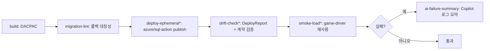

# K — GitHub Actions CI 파이프라인 + AI 게이트

스키마 변경이 머지되면 CI가 **DACPAC 빌드 → (임시 환경) 배포 → 스키마 drift/회귀 검사 →
부하 스모크 → 실패 시 Copilot 로그 진단·요약**을 자동 수행한다. Database DevOps 표준 도구
(`sqlpackage`/DacFx, `azure/sql-action`, `azure/login` OIDC)를 사용하되, **실제 배포는 보류**이므로
배포/부하 단계는 가드로 no-op 처리한다.

## 워크플로 위치
- **실제 워크플로**: `.github/workflows/db-ci.yml` (저장소 루트 — Actions가 인식하는 위치)
- **설명·발표대본·스크립트**: 이 폴더(`demos/cicd/K-actions-pipeline/`)

## 파이프라인 단계

`*` = 게이트가 **active** 일 때만 실제 동작. 게이트 active 조건 = `DEPLOY_ENABLED=true` **그리고** Azure secrets 존재.
기본값 `false`(또는 secrets 미설정) → 실 리소스 없이 안전하게 통과. `workflow_dispatch`로 `deploy_enabled=true`를
줘도 secrets가 없으면 "배포했을 것"만 알리고 **hard-fail 없이 green** 유지(데모 안전).

## 구성
| 경로 | 내용 |
|------|------|
| `../../../.github/workflows/db-ci.yml` | 6단계 파이프라인(빌드/린트/배포가드/drift/스모크/AI요약) |
| `scripts/drift-check.sql` | 배포 후 스키마 계약(테이블·컬럼·인덱스) 읽기전용 검증 |
| `scripts/smoke-load.md` | 기존 `workload/game-driver` 재사용한 스모크 부하 안내 |
| `scripts/summarize-failure.md` | 실패 로그 → AI 3줄 요약 프롬프트/산출 위치 |

## 발표 흐름
1. 데모 I가 만든 `db-project`가 **DACPAC**로 빌드되는 것을 보여줌(실 리소스 불필요).
2. `migration-lint`가 up↔down 대칭성을 강제(롤백 없는 마이그레이션은 실패).
3. 배포/drift/스모크 단계는 **가드**로 스킵되며, 각 스텝이 "무엇을 할지"를 로그로 설명.
4. 임의 실패를 유도하면 `ai-failure-summary`가 로그를 모아 **원인→영향→다음 조치**로 요약.
5. 전 구간에서 접속정보는 **OIDC + secrets**로만 주입(하드코딩 없음)임을 강조.

## 기존 수동 방식 vs AI 하네스 방식
| 단계 | 기존 수동 방식 | AI 하네스 + CI 방식 |
|------|---------------|--------------------|
| 빌드/검증 | 로컬에서 손으로 스크립트 적용 | PR마다 DACPAC 빌드 + 롤백 대칭성 게이트 |
| 배포 | SSMS로 수동 실행(사람 실수) | `azure/sql-action` 선언적 배포(파괴변경 차단 옵션) |
| drift/회귀 | 사후에 "왜 다르지?"를 수동 대조 | `DeployReport` + 계약 검증으로 자동 감지·실패 |
| 스모크 | 별도로 챙기거나 생략 | 기존 부하 드라이버를 짧게 재사용 |
| 실패 분석 | 긴 로그를 사람이 스크롤 | Copilot이 원인·영향·조치 3줄 요약 |
| 비밀 관리 | 커넥션스트링 하드코딩 유혹 | OIDC/secrets/Key Vault 강제 |

**발표 대본**
> (수동) "배포는 SSMS로 손으로 하고, drift는 사고가 난 뒤에야 알았습니다. CI 로그가 500줄이면 원인 찾다가 반나절이죠."
> (AI) "이제 PR마다 DACPAC이 빌드되고, 롤백 없는 마이그레이션은 자동으로 막힙니다. 배포는 선언적으로, 파괴적 변경은 옵션으로 차단합니다. 실패하면 Copilot이 로그를 요약해 '원인·영향·다음 조치'를 먼저 보여줍니다. 실제 배포는 이 데모에선 가드로 꺼져 있어, 리소스 없이 파이프라인 구조를 그대로 시연합니다."

## 자연어 프롬프트 예시
> 이 스키마 PR용 CI를 구성해 주세요. DACPAC을 빌드하고, 임시 환경에 배포한 뒤 스키마
> drift와 회귀를 검사하고, 짧은 부하 스모크를 돌리고, 실패하면 로그를 요약해 주세요.
> 실제 배포는 아직 하지 말고 가드로 두고, 접속정보는 OIDC/secrets로만 쓰세요.

## Eval 기준
- `db-ci.yml`이 유효한 YAML이고 6개 job이 정의됨(build/migration-lint/deploy-ephemeral/drift-check/smoke-load/ai-failure-summary).
- `DEPLOY_ENABLED=false`(기본)에서 배포/drift/스모크가 안전하게 스킵(가드). `deploy_enabled=true`라도 secrets가 없으면 게이트가 스킵해 green 유지.
- `migration-lint`가 down 누락 시 실패(롤백 대칭성 강제).
- 실패 시 `ai-failure-summary`가 `if: failure()`로 동작해 요약을 Job Summary에 게시.
- 워크플로에 하드코딩된 비밀/커넥션스트링이 없음(모두 `secrets.*`).

## 안전/정책
- 실제 Azure 프로비저닝/배포 없음 — 배포·drift·스모크는 `DEPLOY_ENABLED` 가드.
- OIDC(`azure/login`) + GitHub `secrets` 전제, 커넥션스트링 하드코딩 금지.
- `BlockOnPossibleDataLoss=true`, `DropObjectsNotInSource=false`로 파괴적 변경 방어.
