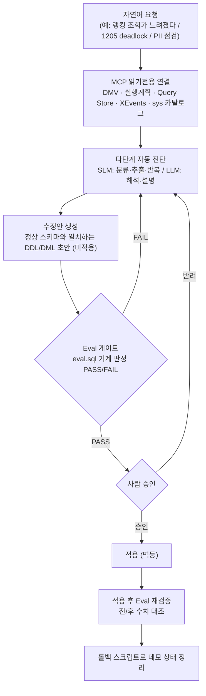

# architecture — AI 하네스 개념도

> AI가 게임 DB의 전 생애주기를 감싸는 하나의 **하네스**. 자연어 요청을 *다단계 진단 → Eval(검증) → 사람 승인* 파이프라인으로 닫고, 값싼 반복은 **SLM**(Phi-4 로컬)·복잡한 해석은 **LLM**(클라우드)·안전 연결은 **MCP**(읽기전용)로 나눠 맡깁니다.

관련 문서: [로드맵](./demo-roadmap.md) · [런북](./runbook.md) · [보안](./security.md) · [발표 스토리보드](./presentation/storyboard.md) · [루트 README](../README.md)

---

## 1. 하네스란 무엇인가

**하네스 엔지니어링**은 LLM/SLM을 그냥 프롬프트로 부르는 것이 아니라, 자연어의 모호함을 **결정론적 근거 수집**과 **기계 판정 가능한 검증**으로 감싸 안전하게 실행 가능한 파이프라인으로 만드는 설계입니다. 게임 DB(핫 테이블 `inventory`·`currency_ledger`, 랭킹 `leaderboard`, PII/결제)는 운영 이슈가 잦고 반복적이라, 1차 진단·근거 수집·검증의 반복 노동을 하네스가 맡고 DBA는 판단·승인·설계에 집중합니다.

핵심 명제: **AI는 DBA를 대체하지 않는다. 근거 수집·재현·검증의 반복을 자동화해 DBA를 판단·승인으로 끌어올린다.**

## 2. 파이프라인 단계도

이 흐름은 운영·Pre-prod·CI/CD 데모 전체가 공유하는 **공통 패턴**입니다: *자연어 → 다단계 자동 진단 → Eval → 사람 승인*.

## 3. 역할 분리 — 데이터 경계 기준 (MCP / SLM / LLM)

계층을 **데이터 경계 안 → 경계 밖** 순으로 배치했습니다. 원칙은 *가능한 한 데이터를 인스턴스/네트워크 경계 안에 두고*, 경계를 넘겨야 가치가 큰 작업만 밖으로 올리는 것입니다.

| 계층 | 데이터 경계 | 무엇 | 이 데모의 쓰임 | 왜 이 계층에 이 모델인가 |
|------|------------|------|----------------|--------------------------|
| **MCP (읽기전용 연결)** | **경계 안** — 읽기전용 연결 계층 | 안전한 도구 연결 계층 | VS Code `mssql` 확장 에이전트 모드(1순위, Entra 인증) + `@azure/mcp`(Log Analytics/Defender) | 진단은 **읽기전용**이 원칙. MCP가 최소권한 연결·근거 수집 경로를 표준화하고, 변경은 이 경로 밖(제안→승인→적용)에 둠 |
| **SLM (Phi-4 로컬)** Foundry Local / Ollama | **경계 안** — 로컬 실행 | 값싼 반복·분류·추출·정적 검증 | [G SQL Pre-flight 린트](../demos/pre-prod/G-sql-preflight-lint/README.md)의 배치 린팅, PII 후보 패턴 추출, 로그/그래프에서 필드 추출 | 반복 호출이 잦고 판단이 규칙적이라 저비용·저지연이 중요. 로컬 실행이라 **코드/데이터가 외부로 나가지 않아** PII·데이터 경계를 지킴 |
| **LLM (추론 엔드포인트)** | **선택** — 자체호스팅=경계 안 / 클라우드=경계 밖 | 복잡한 해석·설명·자연어 리포트 | 데드락 그래프 해석([B](../demos/runtime/B-deadlock-root-cause/README.md)), 회귀 리포트([F](../demos/pre-prod/F-capture-replay-regression/README.md)), PR 위험 서술([J](../demos/cicd/J-pr-risk-review/README.md)) | 근거들 사이의 인과·맥락을 사람이 읽을 설명으로 엮는 고난도 작업. 민감 데이터가 프롬프트에 들어가면 **자체호스팅 추론 엔드포인트(경계 안, OpenAI 호환)** 로 경계를 지키고, 그렇지 않으면 클라우드 엔드포인트로 비용·성능을 최적화 |

> **L/S 하이브리드**의 목적: 비용·지연·데이터 경계를 동시에 최적화. 값싼 반복은 로컬 SLM으로 내려 비용을 낮추고, 데이터를 인스턴스 경계 안에 두며, 복잡한 해석만 LLM으로 올립니다. 이때 **추론 엔드포인트 자체를 자체호스팅(경계 안)으로 둘 수 있어**, LLM 계층도 데이터 경계 안에서 돌릴 선택지를 갖습니다.

MCP 구성의 "무엇·왜"는 [`mcp/README.md`](../mcp/README.md), 추론(SLM/LLM) 엔드포인트 구성과 라이브 연결 절차는 [`mcp/README.md`](../mcp/README.md)의 추론 엔드포인트 절과 [`mcp/LIVE-AGENT-SETUP.md`](../mcp/LIVE-AGENT-SETUP.md)를 참고하세요.

## 4. Eval — 하네스의 안전장치

각 데모는 기계가 판정할 수 있는 **PASS/FAIL 게이트**(`eval.sql`)를 갖습니다. 자연어의 모호함을 수치로 닫는 것이 하네스의 핵심입니다.

| 데모 | Eval 스크립트 | 판정 근거(예) |
|------|---------------|----------------|
| [A 느린 쿼리·인덱스](../demos/runtime/A-slow-query-index/README.md) | `03_eval.sql` | 실행계획 구조 변화 + 논리 읽기 감소 |
| [B 데드락 근본원인](../demos/runtime/B-deadlock-root-cause/README.md) | `03_eval.sql` | 데드락 그래프/victim·락 순서 확인 |
| [O 분류·마스킹·RLS](../demos/pre-prod/O-data-classification-masking/README.md) | `04_eval.sql` | 분류 건수 · 마스크 존재 · RLS 행 필터 실제 축소 |
| [G Pre-flight 린트](../demos/pre-prod/G-sql-preflight-lint/README.md) | `04_eval.sql` | 안티패턴 검출/제거 |

Eval은 두 번 돕니다: **적용 전** 기준치를 기록하고, **적용 후** 전/후를 대조해 "체감상 나아졌다"로 끝나지 않게 합니다. FAIL이면 진단 루프로 되돌아갑니다.

## 5. 사람 승인 원칙 (Guardrails)

- **진단은 읽기전용**: 최소권한 계정으로 DMV/메타데이터만 조회.
- **변경은 제안 → 승인 → 적용**: DDL/DML은 초안으로 생성만 하고, Eval PASS + 사람 승인 후 별도 스크립트로 적용.
- **멱등·롤백 보장**: 모든 T-SQL은 idempotent, 각 데모는 대응 `rollback`/`cleanup`을 제공.
- **파괴적 작업 보호**: 이슈 주입·`-Reset` 등은 명시적 플래그 필요, 공유 MI에서는 인스턴스 레벨 데모를 격리 환경으로 제한.

자세한 보안 원칙은 [`security.md`](./security.md)를 참고하세요.
