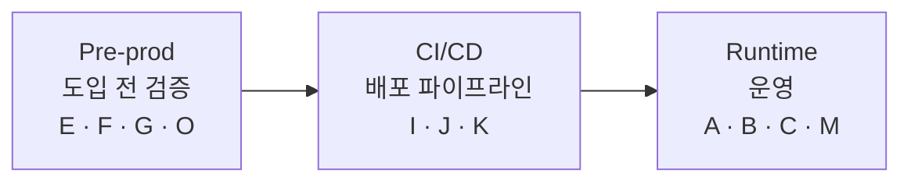

# demo-roadmap — 라이프사이클별 데모 매핑

> 데모 11종을 게임 DB 생애주기 3단계(**도입 전 검증 → 배포 CI/CD → 운영**)에 매핑합니다. 어떤 DBA 페인을, 어느 단계에서, AI 하네스가 어떻게 줄이는지 한눈에 봅니다.

관련 문서: [아키텍처](./architecture.md) · [런북](./runbook.md) · [보안](./security.md) · [발표 스토리보드](./presentation/storyboard.md) · [데모 인덱스](../demos/README.md)

---

## 1. 한눈에 보기

모든 데모는 같은 **공통 패턴**을 따릅니다: *자연어 → 다단계 자동 진단 → Eval → 사람 승인*.
실제 AI 경로는 두 가지입니다: **경로 A**(VS Code Copilot agent + mssql MCP)와 **경로 B**(Cockpit AI 진단 패널 → Azure AI Foundry 관리형 엔드포인트). 경로 B 구성은 [`cockpit/README.md`](../cockpit/README.md)를 참고하세요.

## 2. Pre-prod — 도입 전 검증

배포/도입 **전에** 워크로드·품질·개인정보 리스크를 미리 잡습니다.

| 단계 | 코드 | 제목 | 해결하는 DBA 페인 | AI 기여 | 경로 |
|------|------|------|-------------------|---------|------|
| Pre-prod | **E** | AI 부하 시나리오 합성 | 현실적 부하 시나리오를 손으로 설계하기 어려움 | 자연어 요구 → 워크로드 프로파일 + 드라이버/HammerDB 파라미터 생성 | [E-load-scenario-synthesis](../demos/pre-prod/E-load-scenario-synthesis/README.md) |
| Pre-prod | **F** | 캡처 → 리플레이 회귀검증 | 티어/버전 업그레이드 회귀를 사람이 대조 | 리플레이 후 wait/duration 델타를 자연어 회귀 리포트로(DEA의 AI판) | [F-capture-replay-regression](../demos/pre-prod/F-capture-replay-regression/README.md) |
| Pre-prod | **G** | 배포 전 SQL Pre-flight 정적검증 (SLM) | 배포 전 SP/쿼리 안티패턴을 매번 수동 리뷰 | 로컬 Phi-4급 SLM이 누락인덱스·non-SARGable·형변환·풀스캔 린팅 | [G-sql-preflight-lint](../demos/pre-prod/G-sql-preflight-lint/README.md) |
| Pre-prod | **O** | 민감정보 자동분류 + DDM·RLS 정책 생성 | PII 컬럼 식별·마스킹/RLS 정책을 손으로 작성·누락 | PII 자동분류 → 마스킹/행수준보안 정책 초안·적용(보안 플래그십) | [O-data-classification-masking](../demos/pre-prod/O-data-classification-masking/README.md) |

## 3. CI/CD — 배포 파이프라인 (Database-as-Code)

핵심 개념 = **Database-as-Code + AI 리뷰·게이트**. `[I] → [J] → [K]`가 하나의 파이프라인으로 이어집니다(I의 DACPAC이 K의 빌드 입력물).

| 단계 | 코드 | 제목 | 해결하는 DBA 페인 | AI 기여 | 경로 |
|------|------|------|-------------------|---------|------|
| CI/CD | **I** | 자연어 → 마이그레이션 + 롤백 | 스키마 변경/롤백을 손으로 작성 | 자연어 요구 → idempotent 마이그레이션 + 대칭 롤백 + SQL Database Project(.sqlproj/DACPAC) | [I-nl-migration](../demos/cicd/I-nl-migration/README.md) |
| CI/CD | **J** | PR 위험 리뷰 에이전트 + 보안 게이트 (킬러) | 스키마 PR의 락/breaking/데이터손실 위험을 사람이 눈으로 검토 | 락·breaking·데이터손실·롤백 위험 + 과잉권한·시크릿·마스킹 누락 보안 게이트 | [J-pr-risk-review](../demos/cicd/J-pr-risk-review/README.md) |
| CI/CD | **K** | GitHub Actions 파이프라인 + AI 게이트 | 빌드·배포·검증·실패 분석을 수동 운영 | DACPAC 빌드 → (가드)배포 → drift/회귀 → 스모크 → 실패 시 Copilot 요약 | [K-actions-pipeline](../demos/cicd/K-actions-pipeline/README.md) |

## 4. Runtime — 운영

운영 중 발생하는 대표 장애/보안 이벤트를 **이슈 주입 → 읽기전용 진단 → Eval → 사람 승인 → 수정/롤백**으로 대응합니다.

| 단계 | 코드 | 제목 | 해결하는 DBA 페인 | AI 기여 | 경로 |
|------|------|------|-------------------|---------|------|
| 운영 | **A** | 느린 쿼리 진단 · 인덱스 추천 | 느린 쿼리 원인·인덱스를 여러 SSMS 창에서 수동 대조 | DMV/실행계획 읽기전용 수집 → 누락 인덱스 지목 → 승인 후 적용 | [A-slow-query-index](../demos/runtime/A-slow-query-index/README.md) |
| 운영 | **B** | Deadlock 근본원인 분석 | 1205 데드락 그래프 해석·락 순서 파악이 어려움 | XEvents 그래프 캡처·해석 → victim/락 순서 지목 → 오름차순 락 제안 | [B-deadlock-root-cause](../demos/runtime/B-deadlock-root-cause/README.md) |
| 운영 | **C** | 패치 후 Plan regression 대응 | 파라미터 스니핑/플랜 회귀를 사후에 발견 | Query Store 근거로 회귀 플랜 진단 → 강제 플랜/수정 제안 | [C-plan-regression](../demos/runtime/C-plan-regression/README.md) |
| 운영 | **M** | SQL Injection 탐지 · 진단 | 인젝션 시도 탐지·취약 패턴 식별을 수동으로 | audit/XEvents 근거로 취약 패턴 지목 → 파라미터화 수정 제안 | [M-sql-injection](../demos/runtime/M-sql-injection/README.md) |

> ⚠️ M(인젝션)·tempdb·런어웨이 쿼리 등 인스턴스 레벨 데모는 **격리/전용 MI에서만** 실행합니다([보안](./security.md) 참고).

## 5. 왜 이 순서로 보여주는가

발표 흐름은 생애주기를 따라 **왼쪽에서 오른쪽으로** 갑니다:

1. **도입 전 검증(Pre-prod)** — 문제를 운영에 내보내기 전에 막습니다. 부하를 합성하고(E), 업그레이드 회귀를 리플레이로 잡고(F), 배포 전 정적 린트로 안티패턴을 거르고(G), PII 보호 정책을 배포 전 게이트로 자동화(O).
2. **배포 게이트(CI/CD)** — Database-as-Code로 변경을 만들고(I), PR에서 위험·보안을 게이트하고(J), 파이프라인에 AI 게이트를 삽입(K)해 안전하게 배포합니다.
3. **운영 사고 대응(Runtime)** — 그럼에도 발생하는 실운영 이슈를 이슈 주입으로 재현하고 읽기전용 진단→Eval→승인으로 대응(A/B/C/M)합니다.

즉 **예방(검증) → 통제(게이트) → 대응(운영)** 의 순서로, 각 단계에서 하네스가 반복 노동을 흡수하는 모습을 누적해 보여줍니다.

실제 라이브 발표는 운영 **A·B·O** 중심 3막으로 진행하고 나머지는 맥락으로 짧게 다룹니다 — 세부 대본은 [발표 스토리보드](./presentation/storyboard.md)를 참고하세요.
