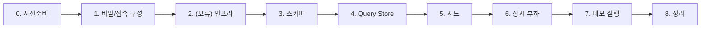

# runbook — 환경 구성 실행 순서 (상세)

> 루트 [README](../README.md) 런북 요약본의 확장판. 데모 환경을 처음부터 세팅하는 순서를 단계별로 정리합니다. 실제 인프라 식별자는 모두 플레이스홀더(`<...>`)이며, 비밀은 하드코딩하지 않습니다(env/Key Vault).

관련 문서: [아키텍처](./architecture.md) · [로드맵](./demo-roadmap.md) · [보안](./security.md) · [MCP 라이브 연결](../mcp/LIVE-AGENT-SETUP.md) · [발표 스토리보드](./presentation/storyboard.md)

---

## 실행 순서 개요



> 발표 때 환경 구성 자체는 데모하지 않지만, 실제 운영처럼 트랜잭션이 흐르고 이슈를 재현할 수 있어야 합니다. 아래 순서로 한 번 세팅해 둡니다.

## 0. 사전준비

- **PowerShell 7+**, **Python 3.10+**, **ODBC Driver 18 for SQL Server**, **Azure CLI**(`az`), **sqlcmd**
- (선택) HammerDB 4.x, C++ 빌드 툴 + MSOLEDBSQL SDK
- Azure: 대상 **구독/테넌트** 접근 권한, MI가 속한 테넌트 확인(크로스테넌트 함정 주의 — [MCP 라이브 연결](../mcp/LIVE-AGENT-SETUP.md) 참고)

```powershell
az login --tenant <demo-tenant>.onmicrosoft.com --use-device-code
az account set --subscription <subscription-id>
```

## 1. 비밀/접속 정보 구성 (하드코딩 금지)

```powershell
Copy-Item .env.example .env
# .env 를 열어 SQLMI_SERVER, AUTH_MODE 등을 채웁니다. 비밀은 Key Vault 권장.
.\scripts\check-prereqs.ps1
```

- `.env`는 git-ignored. 커넥션스트링/비밀은 환경변수 또는 Key Vault 참조만 사용합니다([보안](./security.md)).

## 2. MI/DB 준비 (인프라 — 실행 보류)

실제 Azure 프로비저닝은 **아직 하지 않습니다**. 준비된 Bicep는 검증만 가능합니다.

```powershell
.\infra\deploy.ps1 -SubscriptionId <subscription-id> -WhatIf   # 실행은 환경 확정 후
```

- 인프라 구성 요소(MI, VNet/NSG, Defender for SQL, SQL Audit→Log Analytics, VA, Data Classification, Key Vault)와 파라미터는 [`infra/README.md`](../infra/README.md)를 참고하세요.
- DB `gamedb` 생성 후 다음 단계로 진행합니다.

## 3. 스키마 적용

```powershell
.\scripts\apply-schema.ps1        # 01_tables.sql -> 02_indexes.sql -> 03_query_store.sql (idempotent)
```

- 게임 스키마: `players`, `inventory`(핫), `currency_ledger`(동시성 경합), `matches`, `leaderboard`(랭킹). 상세는 [`schema/README.md`](../schema/README.md).

## 4. Query Store 활성화

```powershell
.\scripts\enable-querystore.ps1   # apply-schema.ps1에도 포함됨
```

- Query Store는 E(부하 시나리오 합성)와 F(캡처/리플레이 회귀)의 관측 근거입니다. 신규 스크립트는 [`.\scripts\enable-querystore.ps1`](../scripts/enable-querystore.ps1)를 참고하세요.
- `apply-schema.ps1`를 이미 실행했다면 같은 설정이 적용되어 있으며, 위 명령은 QS만 다시 보장/확인할 때 사용합니다.

## 5. 시드 적재

```powershell
.\scripts\seed.ps1 -Profile smoke     # 로컬 검증(1,000 players)
.\scripts\seed.ps1 -Profile default   # 데모 규모(100,000 players)
# .\scripts\seed.ps1 -Reset            # 초기화 후 재시드 (파괴적 — 명시적 플래그)
```

- `smoke`는 빠른 검증용, default는 데모 규모입니다. A/C 데모는 규모에 민감하니 재현이 필요하면 default 규모를 사용하세요.
- 시드 구성/규모 변수는 [`schema/README.md`](../schema/README.md)를 참고하세요.

## 6. 상시 부하 드라이버 (계층형)

실제 운영처럼 트랜잭션이 흐르도록 부하를 걸어 둡니다. 필요에 따라 계층을 선택합니다.

```powershell
# (A) 게임 특화 부하 (Python) — 재화 이체/인벤 업데이트/랭킹 조회
cd workload\game-driver
python -m venv .venv; .\.venv\Scripts\Activate.ps1
pip install -r requirements.txt
python driver.py                       # Ctrl+C 까지

# (B) 베이스라인 OLTP — HammerDB TPROC-C
#     workload\hammerdb\README.md 참고

# (C) (선택) C++ MSOLEDBSQL 마이크로 드라이버
#     workload\native\README.md 참고
```

- 부하 계층 구성/파라미터는 [`workload/README.md`](../workload/README.md) 및 각 하위 README를 참고하세요.

## 7. 데모별 실행

각 데모는 폴더의 번호순 스크립트(`01_* → 02_* → eval → 04_* → rollback`)를 따릅니다. 라이프사이클별 매핑과 경로는 [로드맵](./demo-roadmap.md)을 참고하세요.

운영 데모는 **이슈 주입**으로 문제를 유발한 뒤 진단합니다. 예:

```powershell
# #1 누락 인덱스 -> 랭킹 풀스캔 (데모 A)
sqlcmd @(& { . .\scripts\lib.ps1; Import-DotEnv; Get-SqlcmdArgs }) -i issue-injection\01_missing_index.sql
# 롤백
sqlcmd @(& { . .\scripts\lib.ps1; Import-DotEnv; Get-SqlcmdArgs }) -i issue-injection\01_missing_index.rollback.sql
```

- #2(Blocking/Deadlock, 데모 B)는 `sessionA`/`sessionB` 두 스크립트를 **동시에** 실행합니다. 상세는 [`issue-injection/README.md`](../issue-injection/README.md).
- **AI 라이브 연결**로 진단하려면 VS Code `mssql` 확장 에이전트 모드(Entra 읽기전용)로 붙습니다 — 단계별 절차는 [`mcp/LIVE-AGENT-SETUP.md`](../mcp/LIVE-AGENT-SETUP.md), 서버 구성은 [`mcp/README.md`](../mcp/README.md)를 참고하세요(여기서 중복하지 않습니다).
- ⚠️ #6(SQL Injection, 데모 M)·tempdb·런어웨이 쿼리 등 인스턴스 레벨 데모는 **격리/전용 MI에서만**([보안](./security.md)).

## 8. 정리 (cleanup)

- 각 데모의 `05_rollback.sql`/`05_cleanup.sql`로 생성 객체·정책을 원복합니다.
- 이슈 주입은 대응 `*.rollback.sql`로 되돌립니다.
- 임시 인프라(예: NSG 3342 인바운드 규칙)는 데모 후 삭제합니다 — [`mcp/LIVE-AGENT-SETUP.md`](../mcp/LIVE-AGENT-SETUP.md) 7절.

---

## 안전 원칙 요약

- 비밀·커넥션스트링 **하드코딩 금지** → 환경변수/Key Vault(`.env`는 git-ignored).
- MCP/AI 진단은 **읽기전용**. 변경(인덱스 생성 등)은 사람 승인 후 적용.
- 파괴적 작업(이슈 주입, `-Reset`)은 명시적 플래그 필요.

자세한 보안 원칙은 [`security.md`](./security.md)를 참고하세요.
