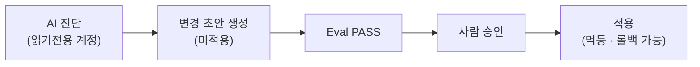

# security — 보안 원칙

> AI 하네스는 **읽기전용 진단 + 사람 승인 변경**을 전제로 합니다. 이 문서는 데모 맥락에서의 보안 스택(Defender/Audit/VA/Data Classification)과 최소권한·시크릿·격리 원칙을 정리합니다.

관련 문서: [아키텍처](./architecture.md) · [로드맵](./demo-roadmap.md) · [런북](./runbook.md) · [MCP 라이브 연결](../mcp/LIVE-AGENT-SETUP.md) · [발표 스토리보드](./presentation/storyboard.md)

---

## 1. 보안 스택 (데모 맥락)

MI 보안 스택은 [`infra/README.md`](../infra/README.md)의 계획된 구성 요소이며, 데모에서는 다음과 같이 쓰입니다.

| 기능 | 무엇을 하나 | 이 데모에서의 역할 |
|------|-------------|--------------------|
| **Microsoft Defender for SQL** | 이상 접근·인젝션·취약점 위협 탐지·알림 | [M SQL Injection](../demos/runtime/M-sql-injection/README.md) 시도 탐지 맥락. 인스턴스 레벨 알림이므로 **격리/전용 MI에서만** 시연 |
| **SQL Audit → Log Analytics** | DB 이벤트 감사 로그를 Log Analytics로 수집 | 인젝션/권한 변경 등의 근거를 읽기전용으로 조회(`@azure/mcp`로 Log Analytics 연동) |
| **Vulnerability Assessment (VA)** | 구성/권한 취약점 베이스라인 스캔·권고 | 배포 전/운영 중 취약 구성 점검. 과잉권한·구성 드리프트 근거 |
| **Data Discovery & Classification** | 민감도 라벨링(PII/결제) + 분류 카탈로그 | [O 분류·마스킹·RLS](../demos/pre-prod/O-data-classification-masking/README.md)의 `ADD SENSITIVITY CLASSIFICATION` 태깅 + DDM 마스킹 근거 |

## 2. 읽기전용 원칙

AI 하네스의 진단은 **최소권한 읽기전용**으로만 이뤄집니다.

- **진단 = 읽기전용 계정**: DMV·실행계획·Query Store·XEvents·`sys` 카탈로그를 조회만. 접속 계정은 least privilege로 제한합니다([MCP 라이브 연결](../mcp/LIVE-AGENT-SETUP.md) 6절 체크리스트).
- **변경 = 제안 → 사람 승인 → 적용**: DDL/DML(인덱스 생성, 마스킹/RLS 정책 등)은 하네스가 **초안으로 생성만** 하고, Eval PASS + 사람 승인 후 별도 스크립트로 적용합니다.
- **MCP 연결 시 승인 게이트**: MCP는 읽기전용 연결 계층입니다. 변경은 MCP 경로 밖(승인된 스크립트 실행)에서 이뤄집니다. 서버 구성/원칙은 [`mcp/README.md`](../mcp/README.md).

## 3. 시크릿 관리

- **하드코딩 금지**: 커넥션스트링·비밀번호·토큰을 코드/config에 넣지 않습니다.
- **env / Key Vault**: 앱·스크립트는 환경변수(`.env`는 git-ignored) 또는 Key Vault 참조를 사용합니다.
- **GitHub Actions**: CI/CD 데모는 `secrets` + OIDC(`azure/login`)로 인증하고, 배포 지점은 가드/더미(`DEPLOY_ENABLED` 등)로 막습니다 — [K Actions 파이프라인](../demos/cicd/K-actions-pipeline/README.md).
- **Entra 토큰 인증**: 라이브 연결은 SQL 비밀번호 없이 `az account get-access-token`으로 토큰을 받아 붙습니다([MCP 라이브 연결](../mcp/LIVE-AGENT-SETUP.md)).
- **시크릿 스캔 게이트**: PR 단계에서 시크릿 노출을 검사합니다 — [J PR 위험 리뷰](../demos/cicd/J-pr-risk-review/README.md)의 보안 게이트.

## 4. 격리 환경 주의 (공유 MI)

인스턴스 레벨 영향을 주는 데모는 **공유 MI에서 실행하지 않습니다**. 격리/전용 데모 MI에서만 실행하세요.

- [M SQL Injection](../demos/runtime/M-sql-injection/README.md)(Defender 알림), tempdb/메모리 압박, 런어웨이 쿼리 등.
- 라이브 연결용 임시 인프라(NSG 3342 인바운드 규칙 등)는 단일 IP/32로 최소 허용하고 **데모 후 삭제**합니다.
- 파괴적 작업(이슈 주입, 시드 `-Reset`)은 명시적 플래그가 필요합니다.

## 5. 데모 O 연계 — 보안 플래그십

[O 민감정보 자동분류 + DDM·RLS](../demos/pre-prod/O-data-classification-masking/README.md)는 이 문서의 원칙을 실제로 구현하는 보안 플래그십 데모입니다.

- **자동분류**: 컬럼명/타입 패턴으로 PII 후보를 발견해 `ADD SENSITIVITY CLASSIFICATION`으로 태깅(읽기전용 → 태깅).
- **DDM(동적 데이터 마스킹)**: `UNMASK` 권한 없는 사용자에게 `email`/`username` 마스킹.
- **RLS(행 수준 보안)**: `region` 기반 행 필터. 안전 술어로 컨텍스트 미설정 시 전체 허용 → **부하 드라이버/타 데모에 무영향**.
- **격리·합성 데이터**: 실 PII·실 카드번호 없이 합성 데이터만 사용. "공격"이 아니라 **보호 정책 자동화**(AI 방어) 관점.
- 모든 생성물은 `05_rollback.sql`로 전량 원복 — 배포 전 개인정보 게이트로 반복 적용 가능.
